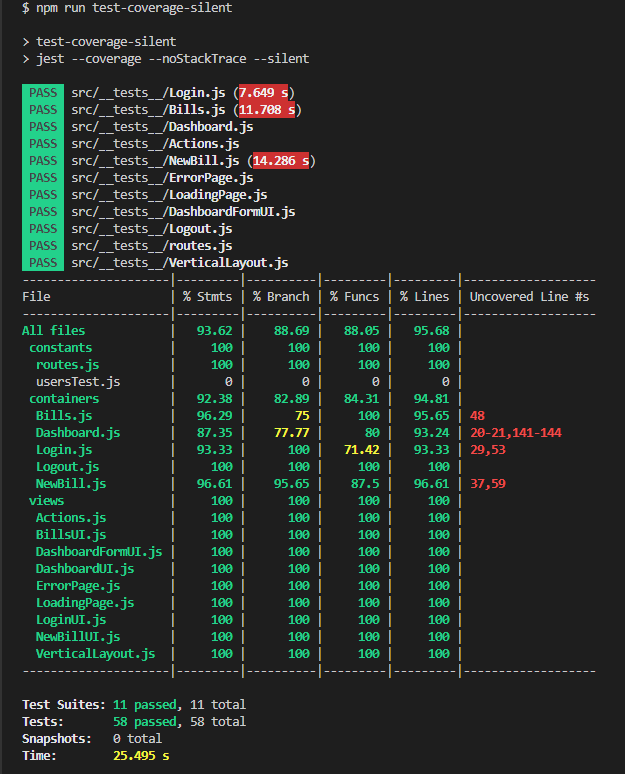
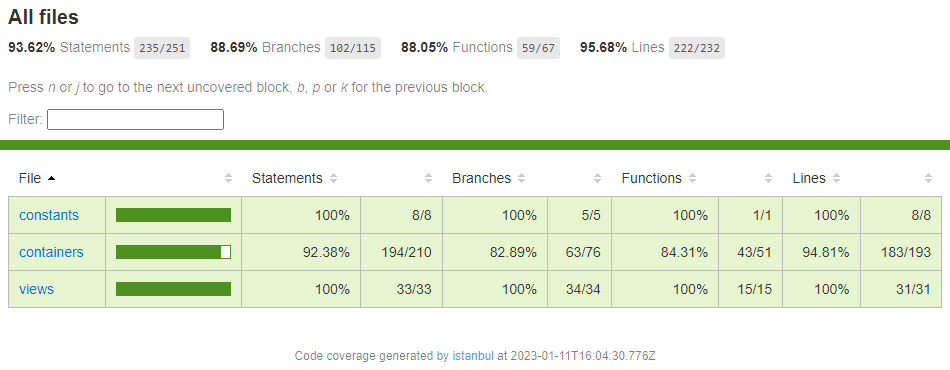

# P9_TAYLOR_Heather

## Description

Billed est une entreprise qui produit des solutions Saas destinées aux équipes de ressources humaines.

[Description des fonctionnalités](https://s3.eu-west-1.amazonaws.com/course.oc-static.com/projects/DA+JSR_P9/Billed+-+Description+des+fonctionnalite%CC%81s.pdf)

[Description pratique des besoins](https://course.oc-static.com/projects/DA+JSR_P9/Billed+-+Description+pratique+des+besoins+-.pdf)

[Kanban Notion](https://www.notion.so/a7a612fc166747e78d95aa38106a55ec?v=2a8d3553379c4366b6f66490ab8f0b90)

[Issues](https://github.com/htaylor91/P9_TAYLOR_Heather/issues)

[Plan de test End-to-End du parcours administrateur RH](https://acrobat.adobe.com/link/track?uri=urn:aaid:scds:US:39328f5b-a496-36f8-92c6-0c23ebd4a228)

## Jest

### Rapport de tests

### Rapport de couverture

## Construit avec

- HTML5
- CSS
- JavaScript
